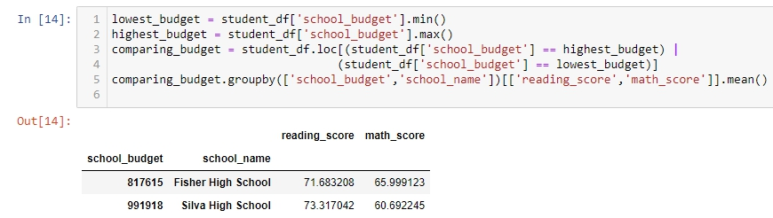

# School District Analysis

## Project Overview
Utilizing an updated "new_full_student_data.csv" file to perform analysis on test results across multiple charter and public schools.

## Resources
* Jupyter Notebook

## Findings

Looking at the overall summary of the data after null and duplicated data rows were removed, students performed better on reading test than the math test - both the minimum grade and average was higher for reading. Student named Matthew Thomas in Dixon High School, high school ranking at 3rd with most number of students, performed the poorest in reading test, scoring 10.5.

An anyalysis that may be worthwhile to see is an average reading and math scores across all schools, by grade. This can be done by using `student_df.groupby(['school_name','grade']).mean()`. Also since there is an added data with "school_budget," it'll be interesting to see if schools with higher budget performed better than those with lower budget. 

```
lowest_budget = student_df['school_budget'].min()
highest_budget = student_df['school_budget'].max()
comparing_budget = student_df.loc[(student_df['school_budget'] == highest_budget) |
                                 (student_df['school_budget'] == lowest_budget)]
comparing_budget.groupby(['school_budget','school_name'])[['reading_score','math_score']].mean()

```

